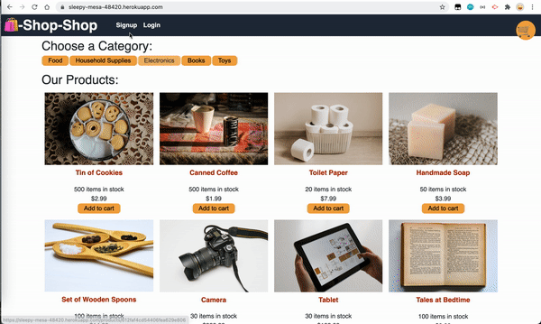

[](https://opensource.org/licenses/MIT)
# redux-store

This project is to refactor the e-commerce platform so that it uses [Redux](https://redux.js.org/) to manage global state instead of the Context API, so that the website's state management is taken out of the React ecosystem

## Table of Contents
* [Installation](#installation)
* [Built With](#built-with)
* [Features](#features)
* [Demo GIF](#demo-gif)
* [Deployed Page](#deployed-page)
* [Author](#author)
* [Questions](#questions)
* [Acknowledgments](#acknowledgments)

## Installation
```bash
git clone https://github.com/qtian13/redux-store.git
```

## Built With
* [CSS](https://www.w3schools.com/css/)
* [JavaScript](https://www.javascript.com/)
* [NodeJS](https://nodejs.org/en/)
* [npm](https://www.npmjs.com/)
* [React](https://reactjs.org/)
* [Redux](https://redux.js.org/)

## Features
* When user review the app’s store, they find that the app uses a Redux store instead of the Context API
* When user review the way the React front end accesses the store, they find that the app uses a Redux provider
* When user review the way the app determines changes to its global state, they find that the app passes reducers to a Redux store instead of using the Context API
* When user review the way the app extracts state data from the store, they find that the app uses Redux instead of the Context API
* When user review the way the app dispatches actions, they find that the app uses Redux instead of the Context API

## Demo GIF


## Deployed Page
https://sleepy-mesa-48420.herokuapp.com/

## Author
Qiushuang Tian
- [Link to Portfolio Site](https://qtian13.github.io/react-portfolio/)
- [Link to Github](https://github.com/qtian13)
- [Link to LinkedIn](https://www.linkedin.com/in/qiushuang-tian-a9754248/)

## Questions
Please reach me out with additional questions!

Emails: qiushuang.tian@gmail.com

## Acknowledgments
- [Berkeley Coding Boot Camp](https://bootcamp.berkeley.edu/coding/) provided mock up gif and starter code